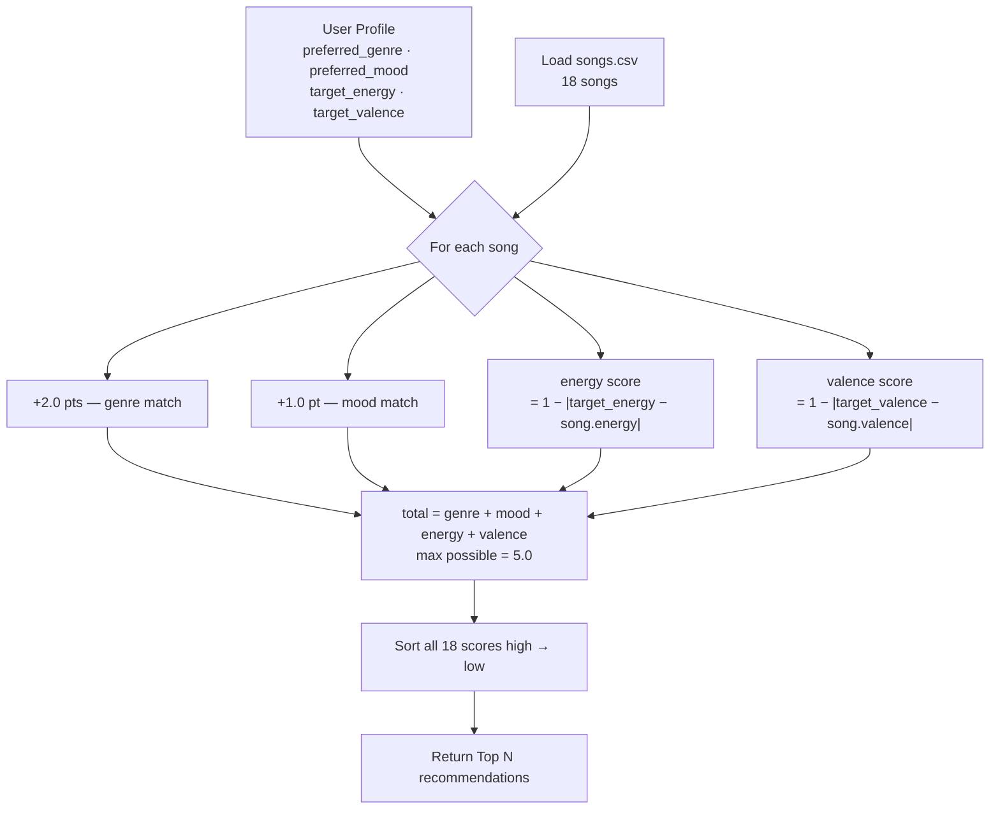

# 🎵 Music Recommender Simulation

## Screenshots


## Project Summary

In this project you will build and explain a small music recommender system.

Your goal is to:

- Represent songs and a user "taste profile" as data
- Design a scoring rule that turns that data into recommendations
- Evaluate what your system gets right and wrong
- Reflect on how this mirrors real world AI recommenders

This version builds a content-based music recommender that matches songs to a user's taste profile using measurable audio features. It scores every song in the catalog against what the user prefers—genre, mood, and numerical attributes like energy and valence—then returns the top matches ranked by score.

---

## How The System Works

Real-world recommenders (Spotify, YouTube) work by representing content as vectors of features and finding items that are closest to a user's history or stated preferences. They layer in popularity signals, collaborative filtering (what similar users liked), and business rules on top of that core similarity score. This simulation focuses on just the content-based layer: we describe each song by its attributes and compare them directly to what the user says they want.

**`Song` features:**

| Feature | Type | What it captures |
|---|---|---|
| `genre` | categorical | broad style (pop, lofi, rock, jazz, synthwave, indie pop, ambient) |
| `mood` | categorical | emotional tone (happy, chill, intense, relaxed, focused, moody) |
| `energy` | float 0–1 | loudness and intensity |
| `valence` | float 0–1 | musical positivity |
| `danceability` | float 0–1 | rhythmic drive |
| `tempo_bpm` | int | beats per minute |
| `acousticness` | float 0–1 | acoustic vs. electronic character |

**`UserProfile` stores:**

- `preferred_genre` — the genre the user wants to hear
- `preferred_mood` — the mood the user wants to match
- `target_energy` — the energy level they are aiming for (e.g. 0.8 for a workout, 0.3 for studying)
- `target_valence` — how positive or melancholy they want the music to feel

Example profile for a late-night study session:

```python
user_profile = {
    "preferred_genre": "lofi",
    "preferred_mood": "focused",
    "target_energy": 0.40,
    "target_valence": 0.60
}
```

This profile can distinguish between "intense rock" (energy ~0.9, mood=intense) and "chill lofi" (energy ~0.4, mood=chill) because both the categorical fields (genre/mood) and the numerical targets (energy/valence) must align for a high score—a rock song would earn 0 genre points and score poorly on energy proximity even if its valence happens to be close.

---

### Algorithm Recipe

**Input → Process → Output**



**Scoring a single song:**

| Signal | Points | Why this weight |
|---|---|---|
| Genre match | +2.0 | Genre is the biggest "vibe gate"—wrong genre almost always feels wrong |
| Mood match | +1.0 | Mood refines within a genre; useful but less disqualifying |
| Energy proximity | `1 − \|target − value\|` (0–1) | Rewards songs close to the user's energy target |
| Valence proximity | `1 − \|target − value\|` (0–1) | Rewards songs close to the user's positivity target |

Maximum score = **5.0** (perfect genre + mood + energy + valence match).

**Ranking rule:** every song in the catalog is scored, then sorted highest-to-lowest. The top N are returned.

---

### Expected Biases

- **Genre dominance** — genre is worth 2× any other signal, so a song with the perfect energy and valence but a different genre will almost always lose to an on-genre song with mediocre numerics.
- **Catalog skew** — the 18-song catalog has 3 lofi songs and only 1 of most other genres, so lofi listeners will consistently get more options than, say, classical fans.
- **No diversity enforcement** — the system can return 5 nearly identical songs (e.g., all lofi/chill/energy≈0.4) with no mechanism to introduce variety.
- **Categorical rigidity** — genre and mood must match exactly as strings; a "hip-hop" user profile will never match an "r&b" song even if the two songs sound similar.

---

## Getting Started

### Setup

1. Create a virtual environment (optional but recommended):

   ```bash
   python -m venv .venv
   source .venv/bin/activate      # Mac or Linux
   .venv\Scripts\activate         # Windows

2. Install dependencies

```bash
pip install -r requirements.txt
```

3. Run the app:

```bash
python -m src.main
```

### Running Tests

Run the starter tests with:

```bash
pytest
```

You can add more tests in `tests/test_recommender.py`.

---

## Experiments You Tried

**Weight shift — halving genre, doubling energy:**
Changed the genre bonus from +2.0 to +1.0 and the energy multiplier from 1× to
2×. The most dramatic result was in the "Perfectly Neutral Ambient" profile:
rank 1 flipped from the ambient song (which held its position purely on genre
points) to a country song that had stronger mood and energy proximity. This
showed that the genre weight is not just a tuning knob — it decides *which
type of signal wins* when scores are close.

**Adversarial profiles — conflicting preferences:**
Tested a "High-Energy Folk" profile (energy target: 0.90, genre: folk). Folk
only has one song in the catalog and it has energy 0.31 — far from the target.
Despite this, the folk/sad song ranked first because the +2.0 genre bonus plus
+1.0 mood bonus added up to +3.0, which the energy penalty of −0.59 could not
overcome. The system returned a quiet, melancholy song to a user who asked for
high energy.

**Unknown genre — k-pop not in catalog:**
Set preferred genre to "k-pop," which has no catalog entries. The system never
awarded genre points, capping the maximum score at 3.0. Results were still
reasonable (sorted by mood and energy) but were no better than a genre-blind
search, and the user received no indication that their favorite genre was
missing.

---

## Limitations and Risks

- **Tiny catalog:** 18 songs cannot represent the full range of musical taste.
  Genres with only 1 song (rock, metal, jazz, folk, etc.) give users almost no
  real variety.
- **Genre dominance:** The +2.0 genre weight can override large numeric
  mismatches. A song with completely wrong energy can still rank first if it
  matches the genre label.
- **No understanding of sound:** The system only reads CSV fields — it has no
  idea what a song actually sounds like. Two songs labeled "pop/happy" with
  similar energy could sound completely different.
- **Categorical rigidity:** Genre and mood must match as exact strings. Related
  genres (hip-hop and r&b, indie pop and pop) earn zero shared credit.
- **No diversity enforcement:** The top 5 results can all be nearly identical
  songs, especially for genres with multiple catalog entries like lofi.

See [model_card.md](model_card.md) for a deeper analysis.

---

## Reflection

[**Full Model Card →**](model_card.md)

Building this recommender made it clear that every design choice encodes an
assumption about what matters to a listener. Setting genre to +2.0 was an
intuitive call — genre feels like the biggest "vibe gate" — but the adversarial
tests revealed how easily that assumption breaks. A folk listener who wants
high-energy music gets a quiet, sad song as their top result because the label
"folk" is worth more points than being close to their energy target. That is not
a bug in the code; it is a consequence of a weight that made sense on paper but
was not tested against edge cases.

The harder lesson was about catalog bias. The same algorithm produces a much
better experience for a lofi listener (3 matching songs, meaningful variety)
than for a metal listener (1 matching song, then a cliff drop to unrelated
genres). The code is identical for both users — the unfairness lives entirely in
the data. Real systems like Spotify or YouTube face the same dynamic at scale:
the algorithm is only as fair as the catalog it runs on, and catalogs are never
neutral.

