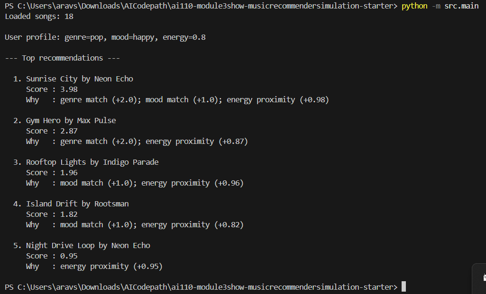
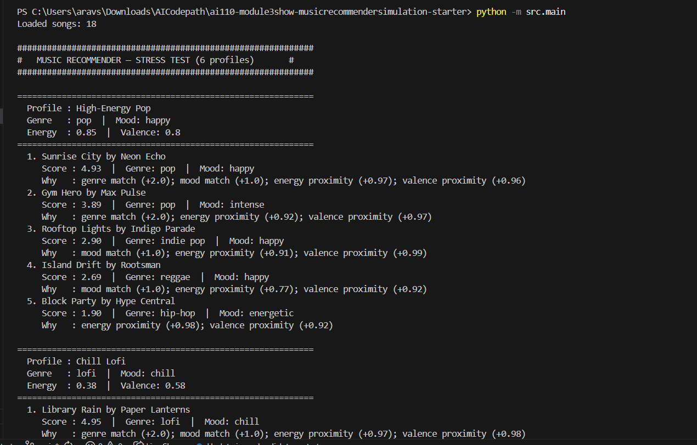
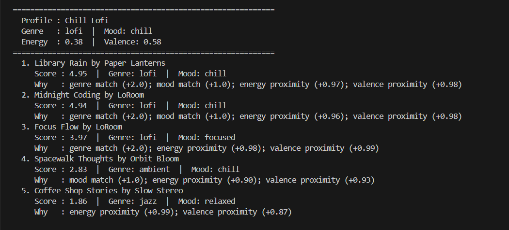
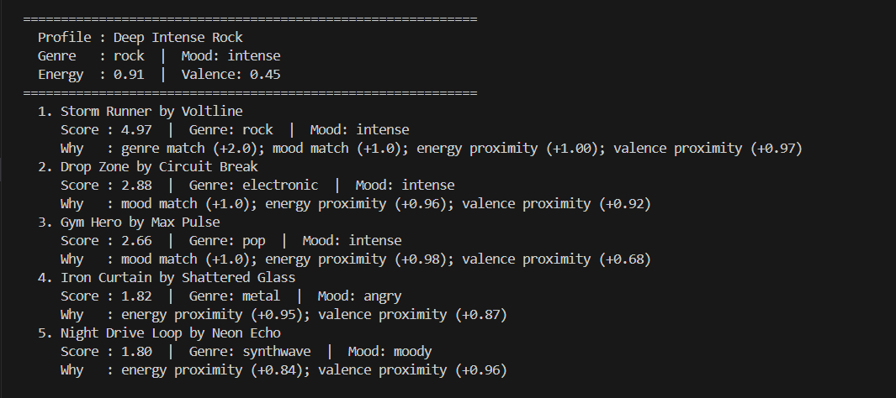
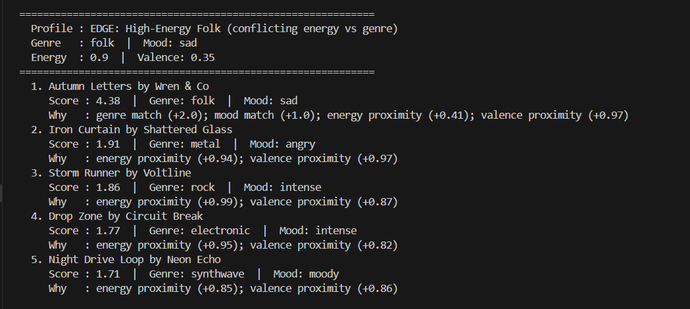
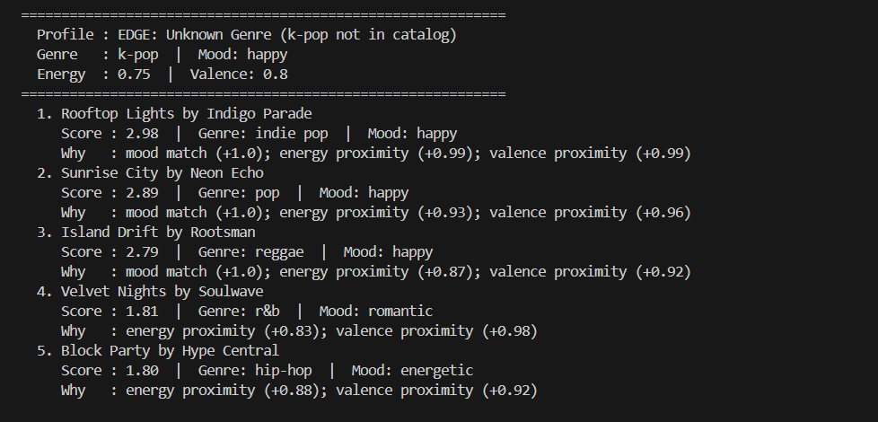
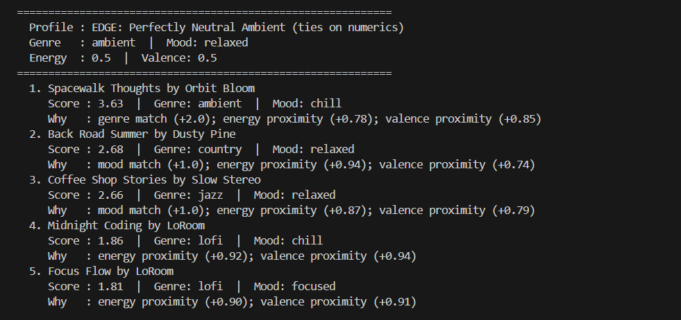
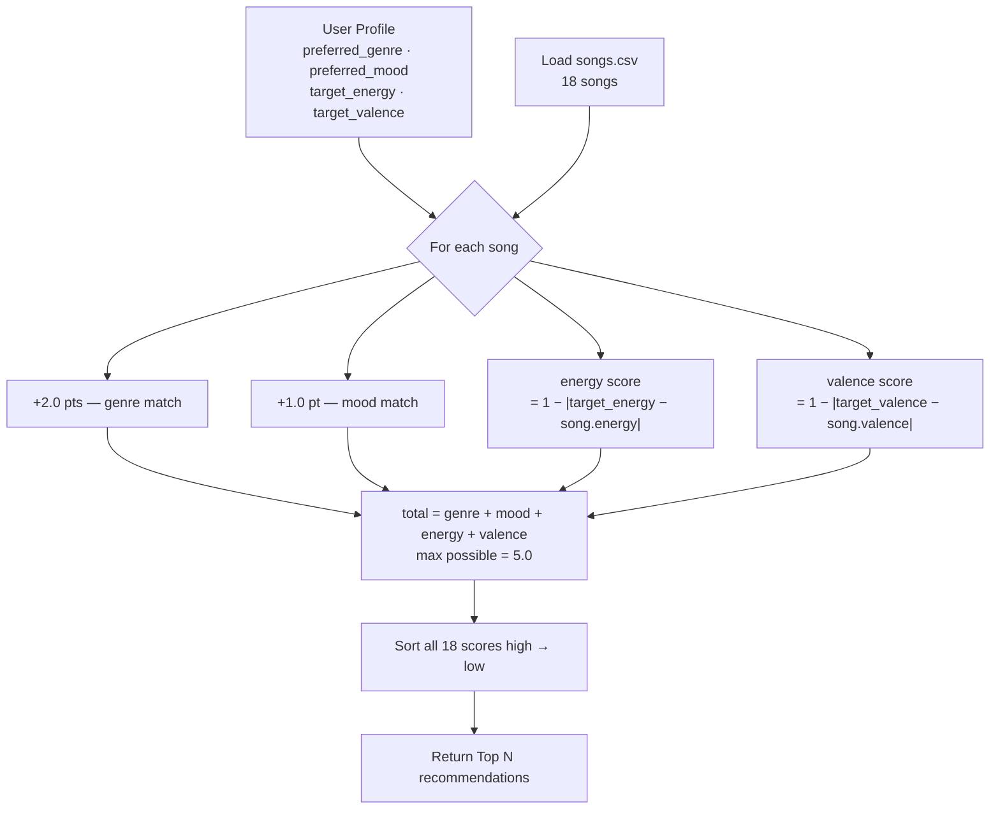

# 🎵 Music Recommender Simulation

## Screenshots








## Project Summary

In this project you will build and explain a small music recommender system.

Your goal is to:

- Represent songs and a user "taste profile" as data
- Design a scoring rule that turns that data into recommendations
- Evaluate what your system gets right and wrong
- Reflect on how this mirrors real world AI recommenders

This version builds a content-based music recommender that matches songs to a user's taste profile using measurable audio features. It scores every song in the catalog against what the user prefers—genre, mood, and numerical attributes like energy and valence—then returns the top matches ranked by score.

---

## How The System Works

Real-world recommenders (Spotify, YouTube) work by representing content as vectors of features and finding items that are closest to a user's history or stated preferences. They layer in popularity signals, collaborative filtering (what similar users liked), and business rules on top of that core similarity score. This simulation focuses on just the content-based layer: we describe each song by its attributes and compare them directly to what the user says they want.

**`Song` features:**

| Feature | Type | What it captures |
|---|---|---|
| `genre` | categorical | broad style (pop, lofi, rock, jazz, synthwave, indie pop, ambient) |
| `mood` | categorical | emotional tone (happy, chill, intense, relaxed, focused, moody) |
| `energy` | float 0–1 | loudness and intensity |
| `valence` | float 0–1 | musical positivity |
| `danceability` | float 0–1 | rhythmic drive |
| `tempo_bpm` | int | beats per minute |
| `acousticness` | float 0–1 | acoustic vs. electronic character |

**`UserProfile` stores:**

- `preferred_genre` — the genre the user wants to hear
- `preferred_mood` — the mood the user wants to match
- `target_energy` — the energy level they are aiming for (e.g. 0.8 for a workout, 0.3 for studying)
- `target_valence` — how positive or melancholy they want the music to feel

Example profile for a late-night study session:

```python
user_profile = {
    "preferred_genre": "lofi",
    "preferred_mood": "focused",
    "target_energy": 0.40,
    "target_valence": 0.60
}
```

This profile can distinguish between "intense rock" (energy ~0.9, mood=intense) and "chill lofi" (energy ~0.4, mood=chill) because both the categorical fields (genre/mood) and the numerical targets (energy/valence) must align for a high score—a rock song would earn 0 genre points and score poorly on energy proximity even if its valence happens to be close.

---

### Algorithm Recipe

**Input → Process → Output**



**Scoring a single song:**

| Signal | Points | Why this weight |
|---|---|---|
| Genre match | +2.0 | Genre is the biggest "vibe gate"—wrong genre almost always feels wrong |
| Mood match | +1.0 | Mood refines within a genre; useful but less disqualifying |
| Energy proximity | `1 − \|target − value\|` (0–1) | Rewards songs close to the user's energy target |
| Valence proximity | `1 − \|target − value\|` (0–1) | Rewards songs close to the user's positivity target |

Maximum score = **5.0** (perfect genre + mood + energy + valence match).

**Ranking rule:** every song in the catalog is scored, then sorted highest-to-lowest. The top N are returned.

---

### Expected Biases

- **Genre dominance** — genre is worth 2× any other signal, so a song with the perfect energy and valence but a different genre will almost always lose to an on-genre song with mediocre numerics.
- **Catalog skew** — the 18-song catalog has 3 lofi songs and only 1 of most other genres, so lofi listeners will consistently get more options than, say, classical fans.
- **No diversity enforcement** — the system can return 5 nearly identical songs (e.g., all lofi/chill/energy≈0.4) with no mechanism to introduce variety.
- **Categorical rigidity** — genre and mood must match exactly as strings; a "hip-hop" user profile will never match an "r&b" song even if the two songs sound similar.

---

## Getting Started

### Setup

1. Create a virtual environment (optional but recommended):

   ```bash
   python -m venv .venv
   source .venv/bin/activate      # Mac or Linux
   .venv\Scripts\activate         # Windows

2. Install dependencies

```bash
pip install -r requirements.txt
```

3. Run the app:

```bash
python -m src.main
```

### Running Tests

Run the starter tests with:

```bash
pytest
```

You can add more tests in `tests/test_recommender.py`.

---

## Experiments You Tried

Use this section to document the experiments you ran. For example:

- What happened when you changed the weight on genre from 2.0 to 0.5
- What happened when you added tempo or valence to the score
- How did your system behave for different types of users

---

## Limitations and Risks

Summarize some limitations of your recommender.

Examples:

- It only works on a tiny catalog
- It does not understand lyrics or language
- It might over favor one genre or mood

You will go deeper on this in your model card.

---

## Reflection

Read and complete `model_card.md`:

[**Model Card**](model_card.md)

Write 1 to 2 paragraphs here about what you learned:

- about how recommenders turn data into predictions
- about where bias or unfairness could show up in systems like this


---

## 7. `model_card_template.md`

Combines reflection and model card framing from the Module 3 guidance. :contentReference[oaicite:2]{index=2}  

```markdown
# 🎧 Model Card - Music Recommender Simulation

## 1. Model Name

Give your recommender a name, for example:

> VibeFinder 1.0

---

## 2. Intended Use

- What is this system trying to do
- Who is it for

Example:

> This model suggests 3 to 5 songs from a small catalog based on a user's preferred genre, mood, and energy level. It is for classroom exploration only, not for real users.

---

## 3. How It Works (Short Explanation)

Describe your scoring logic in plain language.

- What features of each song does it consider
- What information about the user does it use
- How does it turn those into a number

Try to avoid code in this section, treat it like an explanation to a non programmer.

---

## 4. Data

Describe your dataset.

- How many songs are in `data/songs.csv`
- Did you add or remove any songs
- What kinds of genres or moods are represented
- Whose taste does this data mostly reflect

---

## 5. Strengths

Where does your recommender work well

You can think about:
- Situations where the top results "felt right"
- Particular user profiles it served well
- Simplicity or transparency benefits

---

## 6. Limitations and Bias

Where does your recommender struggle

Some prompts:
- Does it ignore some genres or moods
- Does it treat all users as if they have the same taste shape
- Is it biased toward high energy or one genre by default
- How could this be unfair if used in a real product

---

## 7. Evaluation

How did you check your system

Examples:
- You tried multiple user profiles and wrote down whether the results matched your expectations
- You compared your simulation to what a real app like Spotify or YouTube tends to recommend
- You wrote tests for your scoring logic

You do not need a numeric metric, but if you used one, explain what it measures.

---

## 8. Future Work

If you had more time, how would you improve this recommender

Examples:

- Add support for multiple users and "group vibe" recommendations
- Balance diversity of songs instead of always picking the closest match
- Use more features, like tempo ranges or lyric themes

---

## 9. Personal Reflection

A few sentences about what you learned:

- What surprised you about how your system behaved
- How did building this change how you think about real music recommenders
- Where do you think human judgment still matters, even if the model seems "smart"

